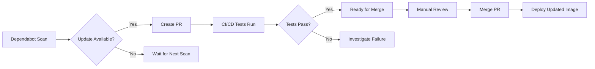
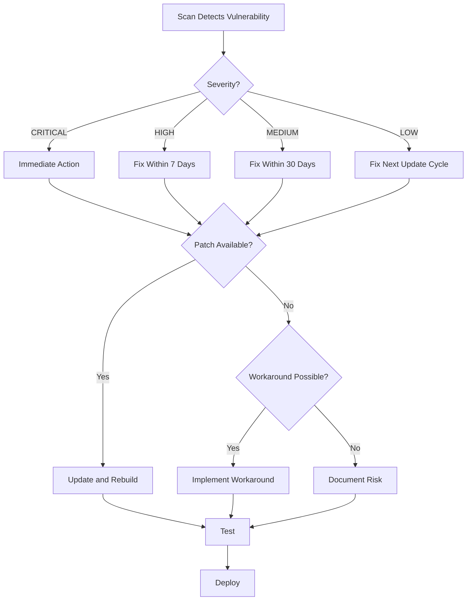

# LinuxServer.io Template - Comprehensive Docker Image Creation Guide

This template provides a standardized foundation for creating Docker images that follow LinuxServer.io standards and best practices.

## Table of Contents

1. [Template Overview and Quick Start](#template-overview-and-quick-start)
2. [LinuxServer.io Baseimage Overview](#linuxserverio-baseimage-overview)
3. [Pre-installed Tools and Packages](#pre-installed-tools-and-packages)
4. [S6 Overlay v3 Architecture](#s6-overlay-v3-architecture)
5. [Environment Variables and Configuration](#environment-variables-and-configuration)
6. [Container Branding Requirements](#container-branding-requirements)
7. [Security Best Practices](#security-best-practices)
8. [Networking Best Practices](#networking-best-practices)
9. [Multi-Architecture Support](#multi-architecture-support)
10. [Dockerfile Best Practices](#dockerfile-best-practices)
11. [CI/CD and Build Pipeline](#cicd-and-build-pipeline)
12. [Dependency Management (Dependabot)](#dependency-management-dependabot)
13. [Vulnerability Scanning](#vulnerability-scanning)
14. [Template Usage Guide](#template-usage-guide)
15. [Template File Structure Reference](#template-file-structure-reference)

---

## Template Overview and Quick Start

### What is This Template?

This is a **complete, production-ready template** for creating Docker images based on LinuxServer.io standards. It includes:

- ✅ **Correct S6 Overlay v3 structure** (with critical fixes for file formats)
- ✅ **Multi-architecture support** (AMD64 + ARM64)
- ✅ **Security hardening** (production-ready configurations)
- ✅ **CI/CD pipelines** (GitHub Actions workflows)
- ✅ **Dependency management** (Dependabot integration)
- ✅ **Comprehensive documentation** (this file!)

### 5-Minute Quick Start

```bash
# 1. Copy template to new project
cp -r docker/images/template/ docker/images/mynewapp/
cd docker/images/mynewapp/

# 2. Find and replace placeholders
find . -type f -exec sed -i 's/audiobookshelf/mynewapp/g' {} \;
find . -type f -exec sed -i 's/mildman1848/myusername/g' {} \;

# 3. Customize Dockerfile
# - Change baseimage if needed (Alpine/Debian/Ubuntu/Arch/Alpine-Nginx)
# - Add your application installation commands
# - Update EXPOSE ports

# 4. Customize S6 services
# - Rename root/etc/s6-overlay/s6-rc.d/audiobookshelf/ to mynewapp/
# - Update service run scripts with actual application startup
# - Update branding file

# 5. Build and test
make build
make test
make validate
make security-scan

# 6. Push to registry
make push
```

### Template Structure at a Glance

```
template/
├── .github/
│   ├── dependabot.yml                  # Automated dependency updates
│   ├── workflows/
│   │   ├── build.yml                   # Multi-arch build pipeline
│   │   ├── security.yml                # Security scanning
│   │   └── version-check.yml           # Upstream monitoring
│   └── ISSUE_TEMPLATE/
├── root/
│   ├── defaults/                       # Default config templates
│   └── etc/s6-overlay/s6-rc.d/
│       ├── init-audiobookshelf-config/        # Initialization service
│       ├── audiobookshelf/                    # Main application service
│       └── user/                       # Service bundle
├── Dockerfile                          # AMD64 image
├── Dockerfile.aarch64                  # ARM64 image
├── docker-compose.yml                  # Basic configuration
├── docker-compose.override.yml         # Development security
├── docker-compose.production.yml       # Production security
├── Makefile                            # Build automation
└── README.md                           # Project documentation
```

### Critical Success Factors

⚠️ **MUST DO:**
1. **S6 type files:** NO trailing newlines! Use `printf "oneshot"` not `echo`
2. **Oneshot services:** MUST have both `up` (path reference) and `run` (script)
3. **Custom branding:** MUST replace LinuxServer.io branding
4. **User bundle:** All services MUST be in `user/contents.d/`
5. **Test thoroughly:** Build, start, check logs, verify health

🚫 **DON'T DO:**
1. Don't use `s6-setuidgid` in service scripts (causes Windows issues)
2. Don't hardcode environment variables (use `${VAR:-default}`)
3. Don't skip pre-push validation (use `make validate && make security-scan`)
4. Don't use `/config` for SQLite databases (use `/data` instead)
5. Don't enable strict security in docker-compose.yml (breaks S6, use override files)

---

## LinuxServer.io Baseimage Overview

### Available Baseimages

LinuxServer.io provides five official baseimages, each optimized for different use cases:

#### 1. **docker-baseimage-alpine**
- **Base OS:** Alpine Linux
- **Support Duration:** 2 years per Alpine release
- **Use Case:** Minimal footprint, general-purpose containers
- **Best For:** Go binaries, Node.js apps, Python apps, lightweight services

#### 2. **docker-baseimage-arch**
- **Base OS:** Arch Linux
- **Support Duration:** Rolling release (continuous updates)
- **Use Case:** Cutting-edge packages, AUR access
- **Best For:** Applications requiring latest software versions

#### 3. **docker-baseimage-debian**
- **Base OS:** Debian Linux
- **Support Duration:** 5 years per Debian release
- **Use Case:** Stable, long-term support containers
- **Best For:** Production environments requiring stability

#### 4. **docker-baseimage-alpine-nginx**
- **Base OS:** Alpine Linux + Nginx
- **Support Duration:** 2 years
- **Use Case:** Web applications requiring Nginx
- **Best For:** PHP apps, static sites, reverse proxy applications

#### 5. **docker-baseimage-ubuntu**
- **Base OS:** Ubuntu Linux
- **Support Duration:** 5 years per Ubuntu LTS release
- **Use Case:** Broad package availability, familiar environment
- **Best For:** Complex applications with many dependencies

### Common Baseimage Features

All LinuxServer.io baseimages include:

- **S6 Overlay v3** for process supervision and initialization
- **PUID/PGID support** for user permission mapping
- **FILE__ prefix** for Docker secrets support
- **Custom initialization hooks** (/custom-cont-init.d)
- **Docker Mods support** for community extensions
- **Multi-architecture builds** (x86_64, aarch64, armhf where applicable)
- **No `latest` tag** by design (prevents unexpected breaking changes)

### Baseimage Selection Guide

| Requirement | Recommended Baseimage |
|-------------|----------------------|
| Smallest image size | Alpine |
| Long-term stability | Debian or Ubuntu |
| Latest software versions | Arch |
| Web application with Nginx | Alpine-Nginx |
| Maximum package availability | Ubuntu or Debian |
| Go/Rust binaries | Alpine (smallest) |
| Python applications | Alpine or Debian |
| Node.js applications | Alpine |
| Java applications | Debian or Ubuntu |

---

## Pre-installed Tools and Packages

### Alpine Baseimage Packages

The Alpine baseimage comes with these essential packages pre-installed:

#### Core System Packages
- **alpine-release** - Alpine version information
- **bash** - Bash shell (replaces default sh)
- **ca-certificates** - Common CA certificates for SSL/TLS
- **catatonit** - Simple container init for signal handling
- **coreutils** - GNU core utilities
- **curl** - HTTP client for downloads and API calls
- **findutils** - GNU find, xargs, locate
- **jq** - JSON processor for parsing JSON data
- **netcat-openbsd** - Network testing and debugging
- **procps-ng** - Process monitoring tools (ps, top, etc.)
- **shadow** - User and group management utilities
- **tzdata** - Timezone data for TZ environment variable

#### Custom LinuxServer.io Tools

These tools are unique to LinuxServer.io baseimages and should NOT be reinstalled:

##### 1. **docker-mods**
- **Location:** `/docker-mods`
- **Purpose:** Applies community-created container modifications
- **Usage:** Set via `DOCKER_MODS` environment variable
- **Documentation:** https://github.com/linuxserver/docker-mods

##### 2. **package-install**
- **Location:** `/usr/bin/package-install`
- **Purpose:** Package manager wrapper for consistent installations
- **Usage:** Use in RUN commands instead of direct `apk add`
- **Benefits:** Handles cleanup and optimization automatically

##### 3. **lsiown**
- **Location:** `/usr/bin/lsiown`
- **Purpose:** PUID/PGID-aware ownership changes
- **Usage:** Use instead of `chown` in init scripts
- **Benefits:** Respects runtime PUID/PGID settings, cross-platform compatible

##### 4. **with-contenv**
- **Location:** `/usr/bin/with-contenv`
- **Purpose:** Run commands with container environment variables
- **Usage:** `#!/usr/bin/with-contenv bash` in S6 scripts
- **Benefits:** Ensures scripts have access to all environment variables

### Default User Configuration

All baseimages create a default non-root user:

- **Username:** `abc`
- **UID:** 911 (configurable via PUID)
- **GID:** 911 (configurable via PGID)
- **Primary Group:** `users`
- **Home Directory:** `/config`
- **Shell:** `/bin/false` (non-interactive by default)

### Pre-created Directories

The following directories are created in all baseimages:

- **/app** - Application installation directory
- **/config** - Configuration files (user `abc` home directory)
- **/defaults** - Default configuration templates
- **/lsiopy** - Python virtual environment for LinuxServer.io tools

---

## S6 Overlay v3 Architecture

### What is S6 Overlay?

S6 Overlay v3 is a process supervisor and init system specifically designed for containers. It provides:

- **Service Management:** Start, stop, restart services
- **Dependency Management:** Define service startup order
- **Graceful Shutdowns:** Proper signal handling and cleanup
- **Logging:** Centralized service logging
- **Initialization Hooks:** Custom scripts at various startup stages

### S6 Service Structure

S6 services are located in `/etc/s6-overlay/s6-rc.d/` and follow this structure:

```
/etc/s6-overlay/s6-rc.d/
├── user/                          # User bundle (services to run)
│   └── contents.d/
│       ├── init-config
│       └── myapp
├── init-config/                   # Oneshot initialization service
│   ├── type                       # "oneshot" (run once then exit)
│   ├── up                         # Path to run script
│   ├── run                        # Executable initialization script
│   └── dependencies.d/
│       └── init-adduser           # Run after init-adduser
└── myapp/                         # Longrun application service
    ├── type                       # "longrun" (keep running)
    ├── run                        # Executable service script
    └── dependencies.d/
        └── init-config            # Run after init-config
```

### Pre-installed S6 Services

The baseimage includes these standard S6 services:

#### Core Initialization Services (Oneshot)

1. **init-adduser**
   - Creates/modifies `abc` user with PUID/PGID
   - Sets up home directory permissions
   - Displays branding and version information

2. **init-config**
   - Processes environment variables
   - Sets up initial configuration

3. **init-config-end**
   - Finalizes configuration setup
   - Marker for end of configuration phase

4. **init-crontab-config**
   - Configures crontab if needed
   - Sets up scheduled tasks

5. **init-custom-files**
   - Processes files in `/custom-cont-init.d`
   - Runs custom initialization scripts

6. **init-device-perms**
   - Sets device file permissions
   - Handles /dev access requirements

7. **init-envfile**
   - Processes environment files
   - Loads additional environment variables

8. **init-migrations**
   - Handles data migrations between versions
   - Upgrades configuration formats

9. **init-mods**
   - Initializes Docker Mods environment
   - Prepares for mod installations

10. **init-mods-package-install**
    - Installs packages required by Docker Mods
    - Downloads and applies mods

11. **init-services**
    - Prepares service environment
    - Sets up service dependencies

#### Background Services (Longrun)

1. **svc-cron**
   - Runs cron daemon for scheduled tasks
   - Manages periodic jobs

### Service Dependency Chain

The standard initialization order is:

```
init-adduser
    ↓
init-config
    ↓
init-envfile
    ↓
init-mods
    ↓
init-mods-package-install
    ↓
init-custom-files
    ↓
[Your custom init services]
    ↓
init-config-end
    ↓
init-services
    ↓
[Your application services]
```

### S6 Service Types

#### Oneshot Services
- **Purpose:** Run once during initialization then exit
- **Type File:** `printf "oneshot" > type` (NO trailing newline!)
- **Run Script:** Executable bash script
- **Up File:** Non-executable path reference to run script
- **Use Cases:** Configuration, setup, migrations

**Example Oneshot Service Structure:**
```bash
# Create service directory
mkdir -p root/etc/s6-overlay/s6-rc.d/init-myapp-config

# Create type file (no trailing newline!)
printf "oneshot" > root/etc/s6-overlay/s6-rc.d/init-myapp-config/type

# Create executable run script
cat > root/etc/s6-overlay/s6-rc.d/init-myapp-config/run <<'EOF'
#!/usr/bin/with-contenv bash
echo "Configuring myapp..."
# Your initialization logic here
EOF
chmod 755 root/etc/s6-overlay/s6-rc.d/init-myapp-config/run

# Create non-executable up file with path reference
printf "/etc/s6-overlay/s6-rc.d/init-myapp-config/run" > root/etc/s6-overlay/s6-rc.d/init-myapp-config/up
chmod 644 root/etc/s6-overlay/s6-rc.d/init-myapp-config/up

# Add dependency
mkdir -p root/etc/s6-overlay/s6-rc.d/init-myapp-config/dependencies.d
touch root/etc/s6-overlay/s6-rc.d/init-myapp-config/dependencies.d/init-custom-files

# Add to user bundle
touch root/etc/s6-overlay/s6-rc.d/user/contents.d/init-myapp-config
```

#### Longrun Services
- **Purpose:** Keep application running continuously
- **Type File:** `printf "longrun" > type` (NO trailing newline!)
- **Run Script:** Executable script that runs application (must not exit)
- **Up File:** Not used for longrun services
- **Use Cases:** Main application, background workers, daemons

**Example Longrun Service Structure:**
```bash
# Create service directory
mkdir -p root/etc/s6-overlay/s6-rc.d/myapp

# Create type file (no trailing newline!)
printf "longrun" > root/etc/s6-overlay/s6-rc.d/myapp/type

# Create executable run script
cat > root/etc/s6-overlay/s6-rc.d/myapp/run <<'EOF'
#!/usr/bin/with-contenv bash
echo "Starting myapp..."
cd /app
exec /app/myapp --config /config/myapp.conf
EOF
chmod 755 root/etc/s6-overlay/s6-rc.d/myapp/run

# Add dependencies
mkdir -p root/etc/s6-overlay/s6-rc.d/myapp/dependencies.d
touch root/etc/s6-overlay/s6-rc.d/myapp/dependencies.d/init-services

# Add to user bundle
touch root/etc/s6-overlay/s6-rc.d/user/contents.d/myapp
```

#### Bundle Services
- **Purpose:** Group multiple services together
- **Type File:** `printf "bundle" > type`
- **Contents.d:** Directory with empty files named after services to include
- **Use Cases:** Logical service grouping, dependency management

### Critical S6 Service Rules

⚠️ **CRITICAL: S6 Overlay v3 File Format Requirements**

1. **Type Files Must Have NO Trailing Newlines**
   - Use `printf "oneshot"` NOT `echo "oneshot"`
   - Trailing newlines cause cryptic S6 compilation errors
   - Valid values: `oneshot`, `longrun`, `bundle` (no trailing newline!)

2. **Oneshot Services Require TWO Files**
   - `up` file = Non-executable (644) path reference to run script
   - `run` file = Executable (755) bash script with actual logic
   - Having only `up` as executable script will print source code as text!

3. **File Permissions Matter**
   - `type`: 644 (non-executable)
   - `up`: 644 (non-executable, only for oneshot services)
   - `run`: 755 (executable)
   - Dependency files: 644 (non-executable, empty files)

4. **Service Registration**
   - All services MUST be added to user bundle
   - `touch root/etc/s6-overlay/s6-rc.d/user/contents.d/service-name`
   - Services not in user bundle will not run!

5. **Cross-Platform Compatibility**
   - Avoid `s6-setuidgid abc` in longrun services (causes Windows Docker Desktop issues)
   - Use `lsiown` instead of `chown` in oneshot services
   - LinuxServer.io baseimage already runs as user `abc`, explicit switching is redundant

### Environment Variables in S6 Scripts

**Standard S6 Environment Variables:**

These are set by S6 Overlay and available in all services:

- `S6_STAGE2_HOOK` - Path to docker-mods script
- `S6_VERBOSITY` - Logging verbosity level
- `S6_CMD_WAIT_FOR_SERVICES_MAXTIME` - Service startup timeout

**Accessing Container Environment Variables:**

Use `#!/usr/bin/with-contenv bash` shebang to access all environment variables:

```bash
#!/usr/bin/with-contenv bash

echo "PUID is: ${PUID}"
echo "Application port: ${APP_PORT}"
```

### Testing S6 Services

**Validation Commands:**

```bash
# Build and start container
make build
make start

# Check S6 service compilation
docker logs <container-name> 2>&1 | grep "s6-rc-compile"

# Verify service structure in built container
docker run --rm --entrypoint sh <image-name> -c "ls -la /etc/s6-overlay/s6-rc.d/init-myservice/"

# Verify type file has no trailing newline
docker run --rm --entrypoint sh <image-name> -c "xxd /etc/s6-overlay/s6-rc.d/init-myservice/type"

# Verify up file contains path reference (oneshot only)
docker run --rm --entrypoint sh <image-name> -c "cat /etc/s6-overlay/s6-rc.d/init-myservice/up"

# Check container health
docker inspect --format='{{.State.Health.Status}}' <container-name>
```

---

## Environment Variables and Configuration

### Standard LinuxServer.io Environment Variables

All LinuxServer.io containers support these standard environment variables:

#### User and Group Mapping
- **PUID** (default: 911) - User ID for file permissions
- **PGID** (default: 911) - Group ID for file permissions
- **UMASK** (default: 022) - File creation mask (use 027 for restrictive permissions)

#### Timezone and Localization
- **TZ** (default: UTC) - Timezone (e.g., Europe/Berlin, America/New_York)

#### Docker Mods
- **DOCKER_MODS** - Comma-separated list of Docker Mods to apply

### FILE__ Prefix for Docker Secrets

LinuxServer.io baseimages support loading sensitive environment variables from files using the `FILE__` prefix:

**How it works:**
1. Prepend `FILE__` to any environment variable name
2. Set the value to a file path containing the secret
3. The baseimage reads the file content and sets the actual variable

**Example:**

```yaml
# docker-compose.yml
services:
  myapp:
    environment:
      - FILE__DB_PASSWORD=/run/secrets/db_password
      - FILE__API_KEY=/run/secrets/api_key
    secrets:
      - db_password
      - api_key

secrets:
  db_password:
    file: ./secrets/db_password.txt
  api_key:
    file: ./secrets/api_key.txt
```

**In the container, these become:**
- `DB_PASSWORD` = contents of `/run/secrets/db_password`
- `API_KEY` = contents of `/run/secrets/api_key`

### PUID/PGID Deep Dive

**Why PUID/PGID?**

Docker containers typically run as root, which creates these issues:
- Files created in volumes are owned by root on the host
- Host users cannot modify container-created files
- Security risk from unnecessary root access

**How it works:**

1. Set `PUID` and `PGID` to match your host user
2. The `init-adduser` service modifies the `abc` user to use these IDs
3. Application runs as user `abc` with your host user's permissions
4. Files created in volumes are owned by your host user

**Finding your PUID/PGID:**

```bash
id $USER
# Output: uid=1000(username) gid=1000(groupname) ...
# Use PUID=1000 PGID=1000
```

**Docker Compose Example:**

```yaml
services:
  myapp:
    image: linuxserver/myapp
    environment:
      - PUID=1000
      - PGID=1000
      - TZ=Europe/Berlin
    volumes:
      - ./config:/config
      - ./data:/data
```

### UMASK Configuration

UMASK controls default permissions for newly created files:

- **022** (default): Files 644 (rw-r--r--), Directories 755 (rwxr-xr-x)
- **027** (restrictive): Files 640 (rw-r-----), Directories 750 (rwxr-x---)
- **077** (paranoid): Files 600 (rw-------), Directories 700 (rwx------)

**Security Recommendation:** Use `UMASK=027` for production deployments

---

## Container Branding Requirements

### Mandatory Branding Changes

⚠️ **IMPORTANT:** If you use LinuxServer.io baseimages or fork their images, you **MUST** change the container branding to avoid user confusion about support channels.

### How to Change Branding

**Method 1: Custom Branding File (Recommended)**

Create a file named `branding` in the init-adduser service directory:

```dockerfile
# In your Dockerfile
COPY root/ /

# Create root/etc/s6-overlay/s6-rc.d/init-adduser/branding with your custom branding:
cat > root/etc/s6-overlay/s6-rc.d/init-adduser/branding <<'EOF'
━━━━━━━━━━━━━━━━━━━━━━━━━━━━━━━━━━━━━━━━━━━━━━
     __  ____   _________  __  ______
    /  |/  / | / / ___/ / / / / __/ /
   / /|_/ /| |/ / /__/ /_/ / _\ \/ /__
  /_/  /_/ |___/\___/\____/ /___/____/

  MyCompany Custom Container
  Based on LinuxServer.io baseimage
━━━━━━━━━━━━━━━━━━━━━━━━━━━━━━━━━━━━━━━━━━━━━━

Support: https://github.com/mycompany/myapp/issues
Documentation: https://docs.mycompany.com/myapp
━━━━━━━━━━━━━━━━━━━━━━━━━━━━━━━━━━━━━━━━━━━━━━
EOF
```

**Method 2: Environment Variable (For Non-Base Images)**

Set the `LSIO_FIRST_PARTY=false` environment variable to prevent LinuxServer.io from overwriting your branding:

```dockerfile
ENV LSIO_FIRST_PARTY=false
```

### Branding Best Practices

1. **Clearly identify your organization** - Don't use LinuxServer.io branding
2. **Provide your support channels** - Direct users to YOUR support resources
3. **Credit the baseimage** - Acknowledge it's based on LinuxServer.io
4. **Include documentation links** - Help users find your documentation
5. **Use ASCII art** - Keep it simple and readable in terminal output

### Example Custom Branding

```
━━━━━━━━━━━━━━━━━━━━━━━━━━━━━━━━━━━━━━━━━━━━━━━━━━━━━━━━━
   ╔═╗┬ ┬┌─┐┌┬┐┌─┐┌┬┐  ╔═╗┌─┐┌┐┌┌┬┐┌─┐┬┌┐┌┌─┐┬─┐
   ║  │ │└─┐ │ │ ││││  ║  │ ││││ │ ├─┤││││├┤ ├┬┘
   ╚═╝└─┘└─┘ ┴ └─┘┴ ┴  ╚═╝└─┘┘└┘ ┴ ┴ ┴┴┘└┘└─┘┴┴└─
━━━━━━━━━━━━━━━━━━━━━━━━━━━━━━━━━━━━━━━━━━━━━━━━━━━━━━━━━

   Application: MyApp v1.2.3
   Based on: LinuxServer.io Alpine Baseimage
   Support: https://github.com/username/myapp/issues

━━━━━━━━━━━━━━━━━━━━━━━━━━━━━━━━━━━━━━━━━━━━━━━━━━━━━━━━━
```

---

## Security Best Practices

### Container Security Principles

Based on Docker and LinuxServer.io security best practices:

#### 1. Run as Non-Root User

✅ **DO:**
- Use the `abc` user (UID 911) provided by baseimage
- Leverage PUID/PGID for host permission mapping
- Drop to non-root in your application startup

❌ **DON'T:**
- Run applications as root unless absolutely necessary
- Use `USER root` in Dockerfile without switching back

**Example:**

```dockerfile
# LinuxServer.io baseimages handle this automatically
# Application runs as user 'abc' by default
```

#### 2. Drop Unnecessary Capabilities

✅ **DO:**
- Use `cap_drop: ALL` in docker-compose.yml
- Only add specific capabilities your app needs
- Document why each capability is required

❌ **DON'T:**
- Use `privileged: true` mode
- Grant `CAP_SYS_ADMIN` unless absolutely necessary

**Example docker-compose.yml:**

```yaml
services:
  myapp:
    image: myapp:latest
    cap_drop:
      - ALL
    cap_add:
      - CHOWN        # If app needs to change file ownership
      - SETUID       # If app needs user switching
      - SETGID       # If app needs group switching
      - NET_BIND_SERVICE  # If app binds to ports < 1024
```

#### 3. Enable Security Options

✅ **DO:**
- Enable `no-new-privileges` to prevent privilege escalation
- Use AppArmor or SELinux profiles
- Implement custom seccomp profiles for additional restrictions

**Example docker-compose.yml:**

```yaml
services:
  myapp:
    image: myapp:latest
    security_opt:
      - no-new-privileges:true
      - apparmor=docker-default
      - seccomp=./security/seccomp-profile.json
```

#### 4. Limit Resources

✅ **DO:**
- Set memory limits to prevent OOM attacks
- Set CPU limits for fair resource sharing
- Limit process count (pids_limit)
- Set ulimits for file descriptors and processes

**Example docker-compose.yml:**

```yaml
services:
  myapp:
    image: myapp:latest
    deploy:
      resources:
        limits:
          cpus: '2.0'
          memory: 1G
          pids: 200
    ulimits:
      nofile:
        soft: 1024
        hard: 2048
      nproc:
        soft: 512
        hard: 1024
```

#### 5. Use Read-Only Filesystems

✅ **DO:**
- Mount root filesystem as read-only when possible
- Use tmpfs for temporary writable directories
- Mount volumes as read-only where appropriate

**Example docker-compose.yml:**

```yaml
services:
  myapp:
    image: myapp:latest
    read_only: true
    tmpfs:
      - /tmp:noexec,nosuid,size=50M
      - /var/tmp:noexec,nosuid,size=50M
      - /run:noexec,nosuid,size=10M
    volumes:
      - ./config:/config:ro  # Read-only config
      - ./data:/data         # Writable data directory
```

#### 6. Secure Secrets Management

✅ **DO:**
- Use Docker secrets or FILE__ prefix for sensitive data
- Never hardcode passwords in Dockerfiles or environment variables
- Use proper file permissions (600) for secret files
- Rotate secrets regularly

❌ **DON'T:**
- Put secrets in environment variables directly
- Commit secrets to git repositories
- Use default passwords

**Example docker-compose.yml:**

```yaml
services:
  myapp:
    image: myapp:latest
    environment:
      - FILE__DB_PASSWORD=/run/secrets/db_password
      - FILE__API_KEY=/run/secrets/api_key
    secrets:
      - db_password
      - api_key

secrets:
  db_password:
    file: ./secrets/db_password.txt
  api_key:
    file: ./secrets/api_key.txt
```

#### 7. Network Isolation

✅ **DO:**
- Use custom bridge networks
- Enable internal networks for backend services
- Bind to localhost (127.0.0.1) when behind reverse proxy
- Use network policies to restrict traffic

**Example docker-compose.yml:**

```yaml
services:
  myapp:
    image: myapp:latest
    networks:
      - frontend
    ports:
      - "127.0.0.1:8080:8080"  # Localhost only

  database:
    image: postgres:latest
    networks:
      - backend  # Internal network, no external access

networks:
  frontend:
    driver: bridge
  backend:
    driver: bridge
    internal: true  # No external access
```

#### 8. Regular Updates and Patching

✅ **DO:**
- Rebuild images regularly to get base image security updates
- Monitor upstream baseimage releases
- Subscribe to security advisories
- Test updates in staging before production

❌ **DON'T:**
- Use automatic updates in production without testing
- Ignore vulnerability scan results
- Run outdated base images

#### 9. Image Source Verification

✅ **DO:**
- Only use official LinuxServer.io baseimages
- Verify image signatures when available
- Review Dockerfiles of third-party images
- Check image popularity and maintenance status

❌ **DON'T:**
- Use images from unknown sources
- Trust images without reviewing their source code

#### 10. Logging and Monitoring

✅ **DO:**
- Implement structured logging
- Use log rotation to prevent disk exhaustion
- Monitor container resource usage
- Set up alerts for suspicious activity

**Example docker-compose.yml:**

```yaml
services:
  myapp:
    image: myapp:latest
    logging:
      driver: "json-file"
      options:
        max-size: "10m"
        max-file: "3"
```

### Security Checklist

Before deploying a container, verify:

- [ ] Application runs as non-root user (abc)
- [ ] All unnecessary capabilities dropped
- [ ] `no-new-privileges` enabled
- [ ] Resource limits configured
- [ ] Secrets managed via FILE__ prefix or Docker secrets
- [ ] Network isolation implemented
- [ ] Volumes mounted with minimal required permissions
- [ ] Custom seccomp profile applied (if needed)
- [ ] Regular update schedule established
- [ ] Vulnerability scanning integrated into CI/CD
- [ ] Logging and monitoring configured

---

## Networking Best Practices

### Network Types

Docker provides several network types, each with different use cases:

#### 1. Bridge Network (Recommended)
- **Use Case:** Default for most containers
- **Features:** Container isolation, DNS resolution, port mapping
- **Best Practice:** Create custom bridge networks instead of using default

#### 2. Internal Network
- **Use Case:** Backend services that shouldn't access external networks
- **Features:** No external connectivity, inter-container communication only
- **Best Practice:** Use for databases, caches, internal APIs

#### 3. Host Network
- **Use Case:** Performance-critical applications needing direct network access
- **Features:** Container shares host network stack
- **Caution:** Reduces isolation, use sparingly

#### 4. None Network
- **Use Case:** Containers that don't need network access
- **Features:** Complete network isolation
- **Best Practice:** Use for batch processing, data transformation tasks

### Network Design Strategies

#### Strategy 1: Frontend/Backend Separation

Separate public-facing services from backend services:

```yaml
services:
  webserver:
    image: nginx:latest
    networks:
      - frontend
      - backend
    ports:
      - "80:80"
      - "443:443"

  app:
    image: myapp:latest
    networks:
      - backend
    # No ports exposed to host

  database:
    image: postgres:latest
    networks:
      - backend
    # No external access

networks:
  frontend:
    driver: bridge
  backend:
    driver: bridge
    internal: true  # No internet access
```

#### Strategy 2: Service-Specific Networks

Create dedicated networks for each service group:

```yaml
services:
  app1:
    image: app1:latest
    networks:
      - app1_network
      - shared

  app2:
    image: app2:latest
    networks:
      - app2_network
      - shared

  redis:
    image: redis:latest
    networks:
      - shared

networks:
  app1_network:
    driver: bridge
    internal: true
  app2_network:
    driver: bridge
    internal: true
  shared:
    driver: bridge
    internal: true
```

#### Strategy 3: Subnet Sizing

Use appropriately sized subnets to limit IP address space:

```yaml
networks:
  mynetwork:
    driver: bridge
    ipam:
      config:
        - subnet: 172.20.0.0/24  # Only 254 usable IPs instead of default /16 (65534 IPs)
          gateway: 172.20.0.1
```

### Port Binding Best Practices

#### 1. Localhost-Only Binding

For services behind a reverse proxy, bind to localhost only:

```yaml
services:
  myapp:
    image: myapp:latest
    ports:
      - "127.0.0.1:8080:8080"  # Only accessible from host
```

#### 2. Minimal Port Exposure

Only expose ports that are absolutely necessary:

```yaml
services:
  myapp:
    image: myapp:latest
    networks:
      - backend
    # No ports exposed - only accessible via Docker network
```

#### 3. Non-Standard Ports

Use non-standard ports to reduce automated attack surface:

```yaml
services:
  ssh:
    image: linuxserver/openssh-server
    ports:
      - "2222:2222"  # Non-standard SSH port
```

### DNS and Service Discovery

Docker provides automatic DNS resolution within networks:

```yaml
services:
  app:
    image: myapp:latest
    environment:
      - DB_HOST=database  # Use service name, not IP
    networks:
      - backend

  database:
    image: postgres:latest
    networks:
      - backend
```

**Benefits:**
- Automatic service discovery
- No need to hardcode IPs
- Services can be restarted without breaking connections

### Network Security Checklist

- [ ] Use custom bridge networks (not default bridge)
- [ ] Enable `internal: true` for backend networks
- [ ] Use minimal subnet sizes (/24 instead of /16)
- [ ] Bind ports to localhost when behind reverse proxy
- [ ] Only expose necessary ports to host
- [ ] Use DNS names for inter-container communication
- [ ] Separate frontend and backend networks
- [ ] Document network architecture in README

---

## Multi-Architecture Support

### LinuxServer.io Multi-Architecture Standards

LinuxServer.io uses OCI manifest lists (also called "fat manifests") to provide multi-architecture support. This allows users to pull the same image tag on different CPU architectures.

### Supported Architectures

Most LinuxServer.io baseimages support:

- **x86_64** (amd64) - Standard desktop/server processors
- **aarch64** (arm64) - ARM 64-bit (Raspberry Pi 4, Apple M1/M2, AWS Graviton)
- **armhf** (arm32) - ARM 32-bit (older Raspberry Pi models)

### Tag Naming Convention

LinuxServer.io uses a specific tagging strategy:

#### Branch Tags (Dynamic)
- `latest` - Latest stable release
- `develop` or `nightly` - Development builds

#### Build Tags (Static)
- `<upstream_version>-<lsio_build_tag>` - Specific reproducible build
- Example: `2.6.0-ls224`

#### Version Tags (Dynamic)
- `version-<upstream_version>` - Latest build of specific version
- Example: `version-2.6.0`

#### Architecture-Specific Tags
- `amd64-latest` - Latest for x86_64
- `arm64v8-latest` - Latest for aarch64
- `arm32v7-latest` - Latest for armhf

### Manifest Lists

When you pull `linuxserver/myapp:latest`, Docker automatically:

1. Queries the manifest list
2. Finds the manifest matching your architecture
3. Downloads the correct image for your platform

**Manifest List Structure Example:**

```json
{
  "schemaVersion": 2,
  "mediaType": "application/vnd.docker.distribution.manifest.list.v2+json",
  "manifests": [
    {
      "mediaType": "application/vnd.docker.distribution.manifest.v2+json",
      "size": 7682,
      "digest": "sha256:abc123...",
      "platform": {
        "architecture": "amd64",
        "os": "linux"
      }
    },
    {
      "mediaType": "application/vnd.docker.distribution.manifest.v2+json",
      "size": 7539,
      "digest": "sha256:def456...",
      "platform": {
        "architecture": "arm64",
        "os": "linux",
        "variant": "v8"
      }
    }
  ]
}
```

### Building Multi-Architecture Images

#### Method 1: Docker Buildx (Recommended)

Docker Buildx provides native multi-architecture build support:

```bash
# Create and use a builder instance
docker buildx create --name multiarch --use

# Build for multiple architectures
docker buildx build \
  --platform linux/amd64,linux/arm64,linux/arm/v7 \
  --tag username/myapp:latest \
  --push \
  .
```

#### Method 2: QEMU Emulation (Local Testing)

Test ARM builds on x86_64 hardware using QEMU:

```bash
# Install QEMU emulators
docker run --rm --privileged multiarch/qemu-user-static --reset -p yes

# Build ARM64 image on x86_64 host
docker buildx build \
  --platform linux/arm64 \
  --tag username/myapp:arm64-latest \
  --load \
  .

# Test the ARM64 image
docker run --rm -it username/myapp:arm64-latest /bin/bash
```

#### Method 3: Native Builds (Best Performance)

Build each architecture on native hardware for best performance and reliability:

```bash
# On x86_64 host
docker build -t username/myapp:amd64-latest .

# On ARM64 host (e.g., Raspberry Pi 4, AWS Graviton)
docker build -t username/myapp:arm64-latest .

# Create and push manifest list
docker manifest create username/myapp:latest \
  username/myapp:amd64-latest \
  username/myapp:arm64-latest

docker manifest push username/myapp:latest
```

### GitHub Actions Multi-Architecture Builds

LinuxServer.io provides reusable GitHub Actions workflows for automated multi-architecture builds.

**Example .github/workflows/build.yml:**

```yaml
name: Build and Push Multi-Arch Image

on:
  push:
    branches:
      - main
  workflow_dispatch:

jobs:
  build:
    runs-on: ubuntu-latest
    steps:
      - name: Checkout
        uses: actions/checkout@v4

      - name: Set up QEMU
        uses: docker/setup-qemu-action@v3

      - name: Set up Docker Buildx
        uses: docker/setup-buildx-action@v3

      - name: Login to Docker Hub
        uses: docker/login-action@v3
        with:
          username: ${{ secrets.DOCKERHUB_USERNAME }}
          password: ${{ secrets.DOCKERHUB_TOKEN }}

      - name: Build and push
        uses: docker/build-push-action@v5
        with:
          context: .
          platforms: linux/amd64,linux/arm64,linux/arm/v7
          push: true
          tags: |
            username/myapp:latest
            username/myapp:${{ github.sha }}
          cache-from: type=gha
          cache-to: type=gha,mode=max
```

### Testing Multi-Architecture Images

**Verify manifest list:**

```bash
# Inspect manifest list
docker manifest inspect username/myapp:latest

# Check specific architecture
docker manifest inspect username/myapp:latest --verbose | grep -A 10 "arm64"
```

**Test on different architectures:**

```bash
# Force pull specific architecture
docker pull --platform linux/arm64 username/myapp:latest

# Run and verify
docker run --rm username/myapp:latest uname -m
# Output: aarch64
```

### Multi-Architecture Best Practices

1. **Always test on real hardware** - QEMU emulation can hide platform-specific bugs
2. **Use buildx for CI/CD** - Simplifies multi-platform builds
3. **Version pin base images** - Ensures consistent builds across architectures
4. **Check package availability** - Some packages may not be available on all architectures
5. **Document architecture support** - Clearly state which architectures you support
6. **Use native builds for release** - Faster and more reliable than emulation

### Architecture-Specific Considerations

#### ARM (arm64, armhf)
- Package names may differ (e.g., `openjdk-11-jdk` vs `openjdk-11-jdk-headless`)
- Some proprietary software may not have ARM builds
- Memory constraints on devices like Raspberry Pi
- Different CPU capabilities (check for NEON, crypto extensions)

#### x86_64 (amd64)
- Widest software support
- Best performance for most workloads
- Standard architecture for cloud providers

---

## Dockerfile Best Practices

### General Dockerfile Principles

Based on Docker official documentation and LinuxServer.io standards:

#### 1. Multi-Stage Builds

Use multi-stage builds to reduce final image size:

```dockerfile
# Stage 1: Build stage
FROM linuxserver/baseimage-alpine:3.20 AS builder

RUN apk add --no-cache \
    build-base \
    python3-dev \
    cargo

COPY requirements.txt /tmp/
RUN pip install --prefix=/install --no-cache-dir -r /tmp/requirements.txt

# Stage 2: Runtime stage
FROM linuxserver/baseimage-alpine:3.20

COPY --from=builder /install /usr/local

COPY root/ /

EXPOSE 8080

VOLUME /config /data
```

#### 2. Layer Optimization

Minimize layers and optimize caching:

```dockerfile
# ❌ BAD: Multiple layers
RUN apk add --no-cache curl
RUN apk add --no-cache jq
RUN apk add --no-cache bash

# ✅ GOOD: Single layer, alphabetically sorted
RUN apk add --no-cache \
    bash \
    curl \
    jq
```

#### 3. .dockerignore Usage

Create a `.dockerignore` file to exclude unnecessary files:

```
# .dockerignore
.git/
.github/
.vscode/
*.md
LICENSE
docker-compose*.yml
Makefile
.env*
config/
data/
logs/
secrets/
*.log
.DS_Store
```

#### 4. COPY vs ADD

Use `COPY` for local files, `ADD` only for auto-extraction or URLs:

```dockerfile
# ✅ GOOD: Use COPY for local files
COPY root/ /
COPY requirements.txt /tmp/

# ✅ GOOD: Use ADD for auto-extraction
ADD https://example.com/app.tar.gz /tmp/
RUN tar -xzf /tmp/app.tar.gz -C /app

# ❌ BAD: Don't use ADD for simple copies
ADD root/ /
```

#### 5. ENTRYPOINT and CMD

LinuxServer.io baseimages set `ENTRYPOINT ["/init"]` for S6 initialization. Don't override this.

```dockerfile
# ✅ GOOD: Don't set ENTRYPOINT, use S6 services
FROM linuxserver/baseimage-alpine:3.20

# Application is started via S6 service, not CMD/ENTRYPOINT

# ❌ BAD: Overriding baseimage ENTRYPOINT breaks S6
ENTRYPOINT ["/app/myapp"]
```

#### 6. Metadata Labels

Add labels for documentation and maintainability:

```dockerfile
LABEL maintainer="your-email@example.com"
LABEL org.opencontainers.image.title="MyApp"
LABEL org.opencontainers.image.description="Custom MyApp container based on LinuxServer.io"
LABEL org.opencontainers.image.version="1.0.0"
LABEL org.opencontainers.image.url="https://github.com/username/myapp"
LABEL org.opencontainers.image.source="https://github.com/username/myapp"
LABEL org.opencontainers.image.licenses="GPL-3.0"
```

#### 7. Argument Variables

Use build arguments for flexibility:

```dockerfile
ARG ALPINE_VERSION=3.20
ARG APP_VERSION=1.2.3

FROM linuxserver/baseimage-alpine:${ALPINE_VERSION}

RUN apk add --no-cache myapp=${APP_VERSION}
```

Build with:

```bash
docker build --build-arg APP_VERSION=1.3.0 -t myapp:1.3.0 .
```

#### 8. Healthchecks

Add healthchecks for container orchestration:

```dockerfile
HEALTHCHECK --interval=30s --timeout=10s --start-period=30s --retries=3 \
  CMD curl -f http://localhost:8080/health || exit 1
```

#### 9. Avoid Unnecessary Installs

Don't install debugging tools in production images:

```dockerfile
# ❌ BAD: Installing unnecessary packages
RUN apk add --no-cache \
    curl \
    vim \
    nano \
    htop \
    bash-completion

# ✅ GOOD: Minimal necessary packages
RUN apk add --no-cache \
    curl \
    bash
```

#### 10. Package Manager Cleanup

LinuxServer.io baseimages handle cleanup automatically, but for manual installs:

```dockerfile
# Alpine
RUN apk add --no-cache --virtual .build-deps \
    build-base \
    python3-dev && \
    pip install mypackage && \
    apk del .build-deps

# Debian/Ubuntu
RUN apt-get update && \
    apt-get install -y --no-install-recommends mypackage && \
    rm -rf /var/lib/apt/lists/*
```

### LinuxServer.io Specific Dockerfile Patterns

#### Pattern 1: Basic Application Install

```dockerfile
FROM linuxserver/baseimage-alpine:3.20

# Set version labels
ARG BUILD_DATE
ARG VERSION
ARG APP_VERSION
LABEL build_version="Version:- ${VERSION} Build-date:- ${BUILD_DATE}"
LABEL maintainer="yourname"

# Install application
RUN apk add --no-cache \
    curl \
    myapp

# Copy local files
COPY root/ /

# Ports and volumes
EXPOSE 8080
VOLUME /config /data
```

#### Pattern 2: Compiled Application

```dockerfile
FROM linuxserver/baseimage-alpine:3.20 AS builder

# Install build dependencies
RUN apk add --no-cache \
    build-base \
    go \
    git

# Build application
WORKDIR /build
COPY . .
RUN go build -o /app/myapp

FROM linuxserver/baseimage-alpine:3.20

# Copy compiled binary
COPY --from=builder /app/myapp /app/

# Copy S6 services and configs
COPY root/ /

EXPOSE 8080
VOLUME /config /data
```

#### Pattern 3: Python Application with Virtual Environment

```dockerfile
FROM linuxserver/baseimage-alpine:3.20

# Install Python and dependencies
RUN apk add --no-cache \
    python3 \
    py3-pip

# Create virtual environment
RUN python3 -m venv /lsiopy

# Install application dependencies
COPY requirements.txt /tmp/
RUN /lsiopy/bin/pip install --no-cache-dir -r /tmp/requirements.txt

# Copy application
COPY app/ /app/

# Copy S6 services
COPY root/ /

# Set Python virtual environment in PATH
ENV PATH="/lsiopy/bin:$PATH"

EXPOSE 8080
VOLUME /config /data
```

#### Pattern 4: Node.js Application

```dockerfile
FROM linuxserver/baseimage-alpine:3.20

# Install Node.js
RUN apk add --no-cache \
    nodejs \
    npm

# Set working directory
WORKDIR /app

# Copy package files
COPY package*.json ./

# Install dependencies
RUN npm ci --only=production && \
    npm cache clean --force

# Copy application
COPY . .

# Copy S6 services
COPY root/ /

EXPOSE 3000
VOLUME /config /data
```

### Dockerfile Validation

Use hadolint to validate Dockerfile best practices:

```bash
# Install hadolint
docker pull hadolint/hadolint

# Validate Dockerfile
docker run --rm -i hadolint/hadolint < Dockerfile

# Or use hadolint locally
hadolint Dockerfile
```

Common hadolint warnings to address:

- `DL3018`: Pin package versions in apk add
- `DL3059`: Multiple consecutive RUN instructions
- `DL3008`: Pin versions in apt-get install
- `DL4006`: Set SHELL option -o pipefail

### Complete Dockerfile Example

Here's a complete example following all best practices:

```dockerfile
# syntax=docker/dockerfile:1

# Build stage
FROM linuxserver/baseimage-alpine:3.20 AS builder

# Install build dependencies
RUN apk add --no-cache \
    build-base \
    curl \
    git

# Build application
WORKDIR /build
ARG APP_VERSION=1.0.0
RUN curl -L https://github.com/example/app/archive/v${APP_VERSION}.tar.gz | tar xz && \
    cd app-${APP_VERSION} && \
    make && \
    make install DESTDIR=/install

# Runtime stage
FROM linuxserver/baseimage-alpine:3.20

# Set version labels
ARG BUILD_DATE
ARG VERSION
ARG APP_VERSION
LABEL build_version="Version:- ${VERSION} Build-date:- ${BUILD_DATE}"
LABEL maintainer="your-email@example.com"
LABEL org.opencontainers.image.title="MyApp"
LABEL org.opencontainers.image.description="MyApp container based on LinuxServer.io Alpine"
LABEL org.opencontainers.image.version="${APP_VERSION}"
LABEL org.opencontainers.image.source="https://github.com/username/myapp"

# Install runtime dependencies
RUN apk add --no-cache \
    ca-certificates \
    libcurl \
    libssl3

# Copy built application from builder
COPY --from=builder /install /

# Copy S6 services and custom files
COPY root/ /

# Set proper permissions for S6 services
RUN find /etc/s6-overlay/s6-rc.d -name "run" -exec chmod 755 {} \; && \
    find /etc/s6-overlay/s6-rc.d -name "up" -exec chmod 644 {} \; && \
    find /etc/s6-overlay/s6-rc.d -name "type" -exec chmod 644 {} \;

# Expose application port
EXPOSE 8080

# Define volumes
VOLUME /config /data

# Healthcheck
HEALTHCHECK --interval=30s --timeout=10s --start-period=30s --retries=3 \
  CMD curl -f http://localhost:8080/health || exit 1
```

---

## CI/CD and Build Pipeline

### LinuxServer.io Pipeline Project

LinuxServer.io uses a sophisticated CI/CD pipeline for automated builds, testing, and deployment. The pipeline is designed to:

1. **Trigger builds automatically** when upstream software releases
2. **Build multi-architecture images** (x86_64, aarch64, armhf)
3. **Run security scans** (vulnerability scanning, linting)
4. **Create manifest lists** for seamless multi-arch support
5. **Push to multiple registries** (Docker Hub, GHCR, Quay, GitLab)
6. **Update documentation** automatically

### GitHub Actions Workflows

LinuxServer.io provides reusable GitHub Actions workflows in the `github-workflows` repository. Key workflows include:

#### 1. Build and Publish Workflow

**Purpose:** Build multi-architecture images and push to registries

**.github/workflows/build.yml:**

```yaml
name: Build and Push

on:
  push:
    branches:
      - main
    paths-ignore:
      - '**.md'
  pull_request:
  workflow_dispatch:

jobs:
  build:
    runs-on: ubuntu-latest
    permissions:
      contents: read
      packages: write

    steps:
      - name: Checkout
        uses: actions/checkout@v4

      - name: Set up QEMU
        uses: docker/setup-qemu-action@v3

      - name: Set up Docker Buildx
        uses: docker/setup-buildx-action@v3

      - name: Login to Docker Hub
        if: github.event_name != 'pull_request'
        uses: docker/login-action@v3
        with:
          username: ${{ secrets.DOCKERHUB_USERNAME }}
          password: ${{ secrets.DOCKERHUB_TOKEN }}

      - name: Login to GitHub Container Registry
        if: github.event_name != 'pull_request'
        uses: docker/login-action@v3
        with:
          registry: ghcr.io
          username: ${{ github.actor }}
          password: ${{ secrets.GITHUB_TOKEN }}

      - name: Extract metadata
        id: meta
        uses: docker/metadata-action@v5
        with:
          images: |
            username/myapp
            ghcr.io/username/myapp
          tags: |
            type=ref,event=branch
            type=ref,event=pr
            type=semver,pattern={{version}}
            type=semver,pattern={{major}}.{{minor}}
            type=sha,prefix={{branch}}-

      - name: Build and push
        uses: docker/build-push-action@v5
        with:
          context: .
          platforms: linux/amd64,linux/arm64,linux/arm/v7
          push: ${{ github.event_name != 'pull_request' }}
          tags: ${{ steps.meta.outputs.tags }}
          labels: ${{ steps.meta.outputs.labels }}
          cache-from: type=gha
          cache-to: type=gha,mode=max
          build-args: |
            BUILD_DATE=${{ github.event.head_commit.timestamp }}
            VERSION=${{ github.ref_name }}
```

#### 2. Security Scanning Workflow

**Purpose:** Scan images for vulnerabilities and security issues

**.github/workflows/security.yml:**

```yaml
name: Security Scan

on:
  push:
    branches:
      - main
  schedule:
    - cron: '0 0 * * 0'  # Weekly on Sunday
  workflow_dispatch:

jobs:
  trivy:
    runs-on: ubuntu-latest
    steps:
      - name: Checkout
        uses: actions/checkout@v4

      - name: Build image
        run: docker build -t test-image:latest .

      - name: Run Trivy vulnerability scanner
        uses: aquasecurity/trivy-action@master
        with:
          image-ref: 'test-image:latest'
          format: 'sarif'
          output: 'trivy-results.sarif'
          severity: 'CRITICAL,HIGH'

      - name: Upload Trivy results to GitHub Security
        uses: github/codeql-action/upload-sarif@v3
        with:
          sarif_file: 'trivy-results.sarif'

  hadolint:
    runs-on: ubuntu-latest
    steps:
      - name: Checkout
        uses: actions/checkout@v4

      - name: Run hadolint
        uses: hadolint/hadolint-action@v3.1.0
        with:
          dockerfile: Dockerfile
```

#### 3. Version Monitoring Workflow

**Purpose:** Check for new upstream versions and create issues

**.github/workflows/version-check.yml:**

```yaml
name: Check Upstream Version

on:
  schedule:
    - cron: '0 0 * * *'  # Daily
  workflow_dispatch:

jobs:
  check-version:
    runs-on: ubuntu-latest
    steps:
      - name: Checkout
        uses: actions/checkout@v4

      - name: Check for updates
        id: check
        run: |
          CURRENT_VERSION=$(cat VERSION)
          LATEST_VERSION=$(curl -s https://api.github.com/repos/upstream/app/releases/latest | jq -r .tag_name | sed 's/^v//')

          if [ "$CURRENT_VERSION" != "$LATEST_VERSION" ]; then
            echo "update_available=true" >> $GITHUB_OUTPUT
            echo "latest_version=$LATEST_VERSION" >> $GITHUB_OUTPUT
          fi

      - name: Create issue for new version
        if: steps.check.outputs.update_available == 'true'
        uses: actions/github-script@v7
        with:
          script: |
            github.rest.issues.create({
              owner: context.repo.owner,
              repo: context.repo.repo,
              title: `New upstream version available: ${{ steps.check.outputs.latest_version }}`,
              body: `A new version of the upstream application is available.\n\nCurrent: ${process.env.CURRENT_VERSION}\nLatest: ${{ steps.check.outputs.latest_version }}\n\nPlease update and rebuild the image.`,
              labels: ['upstream-update']
            })
```

### Local Build and Test Pipeline

For local development, use a Makefile for consistent build and test commands:

**Makefile:**

```makefile
.PHONY: build test push clean

IMAGE_NAME := username/myapp
VERSION := $(shell cat VERSION)

build:
	docker buildx build \
		--platform linux/amd64 \
		--tag $(IMAGE_NAME):latest \
		--tag $(IMAGE_NAME):$(VERSION) \
		--load \
		.

build-multiarch:
	docker buildx build \
		--platform linux/amd64,linux/arm64,linux/arm/v7 \
		--tag $(IMAGE_NAME):latest \
		--tag $(IMAGE_NAME):$(VERSION) \
		--push \
		.

test:
	@echo "Starting container..."
	docker run -d --name test-container \
		-e PUID=1000 \
		-e PGID=1000 \
		$(IMAGE_NAME):latest

	@echo "Waiting for container to be healthy..."
	sleep 10

	@echo "Running tests..."
	docker exec test-container curl -f http://localhost:8080/health || exit 1

	@echo "Checking logs..."
	docker logs test-container

	@echo "Cleaning up..."
	docker rm -f test-container

validate:
	@echo "Validating Dockerfile..."
	docker run --rm -i hadolint/hadolint < Dockerfile

security-scan:
	@echo "Building test image..."
	docker build -t $(IMAGE_NAME):test .

	@echo "Running Trivy scan..."
	docker run --rm -v /var/run/docker.sock:/var/run/docker.sock \
		aquasec/trivy image --severity HIGH,CRITICAL $(IMAGE_NAME):test

push:
	docker push $(IMAGE_NAME):latest
	docker push $(IMAGE_NAME):$(VERSION)

clean:
	docker rmi $(IMAGE_NAME):latest $(IMAGE_NAME):$(VERSION) || true
	docker builder prune -f
```

### Build Stages Best Practices

1. **Validation Stage**
   - Lint Dockerfile (hadolint)
   - Validate docker-compose files
   - Check file permissions
   - Verify S6 service structure

2. **Build Stage**
   - Build for all supported architectures
   - Tag with version and commit SHA
   - Use build cache for faster builds

3. **Test Stage**
   - Start container with test configuration
   - Verify health checks pass
   - Test application functionality
   - Check for errors in logs

4. **Security Stage**
   - Run Trivy vulnerability scan
   - Check for critical/high severity issues
   - Generate SBOM (Software Bill of Materials)
   - Upload results to GitHub Security tab

5. **Publish Stage**
   - Push to Docker Hub
   - Push to GitHub Container Registry
   - Push to additional registries (optional)
   - Create GitHub release (optional)

6. **Documentation Stage**
   - Update README with new version
   - Generate changelog
   - Update version badges

### Release Tag Convention

**IMPORTANT: Release tags MUST match upstream application version exactly.**

```bash
# ✅ CORRECT - Matches upstream audiobookshelf release
gh release create v2.30.0 --title "audiobookshelf v2.30.0"

# ❌ INCORRECT - Do NOT add container-specific suffixes
gh release create v2.30.0-1 --title "audiobookshelf v2.30.0-1"
```

**Rationale:**
- Direct 1:1 mapping to upstream application version
- Clear version identification for users
- Consistent with upstream release tags
- Simplifies version tracking and updates

**If multiple container releases needed for same upstream version:**
- Use pre-release flag: `gh release create v2.30.0 --prerelease`
- Or use separate tags: `v2.30.0-rc1`, `v2.30.0-rc2` (for testing)
- Or rebuild with same tag (GitHub allows tag updates)

**Example workflow:**
```bash
# 1. Update VERSION file
echo "2.30.0" > VERSION

# 2. Update Dockerfile ARG
sed -i 's/ARG AUDIOBOOKSHELF_VERSION=.*/ARG AUDIOBOOKSHELF_VERSION=2.30.0/' Dockerfile

# 3. Commit changes
git add VERSION Dockerfile
git commit -m "⬆️ UPDATE: Bump audiobookshelf to v2.30.0"

# 4. Create release with matching tag
gh release create v2.30.0 \
  --title "audiobookshelf v2.30.0" \
  --notes "Container release for audiobookshelf v2.30.0"
```

### Continuous Integration Checklist

- [ ] Automated builds on push to main branch
- [ ] Multi-architecture builds (amd64, arm64, armhf)
- [ ] Dockerfile linting (hadolint)
- [ ] Container testing (health checks, functionality)
- [ ] Security scanning (Trivy)
- [ ] Version monitoring for upstream updates
- [ ] Automated tagging (semantic versioning)
- [ ] Push to multiple registries
- [ ] GitHub release creation
- [ ] Documentation updates

---

## Dependency Management (Dependabot)

### What is Dependabot?

Dependabot is GitHub's automated dependency update tool that:
- **Monitors dependencies** in your repository
- **Creates pull requests** when updates are available
- **Keeps dependencies current** automatically
- **Improves security** by updating vulnerable packages

### Template Dependabot Configuration

The template includes `.github/dependabot.yml` configured for:

#### 1. GitHub Actions Updates
- **Monitors:** All GitHub Actions workflow files
- **Schedule:** Weekly on Mondays at 6:00 AM
- **Limit:** Maximum 5 open PRs
- **Commit prefix:** `ci:` (for conventional commits)

#### 2. Docker Base Image Updates
- **Monitors:** Dockerfile base image versions
- **Schedule:** Weekly on Mondays at 6:00 AM
- **Limit:** Maximum 5 open PRs
- **Commit prefix:** `build:` (for conventional commits)

### Dependabot Configuration File

```yaml
---
version: 2
updates:
  # GitHub Actions
  - package-ecosystem: "github-actions"
    directory: "/"
    schedule:
      interval: "weekly"
      day: "monday"
      time: "06:00"
    open-pull-requests-limit: 5
    reviewers:
      - "mildman1848"
    labels:
      - "dependencies"
      - "github-actions"
    commit-message:
      prefix: "ci"
      include: "scope"

  # Docker
  - package-ecosystem: "docker"
    directory: "/"
    schedule:
      interval: "weekly"
      day: "monday"
      time: "06:00"
    open-pull-requests-limit: 5
    reviewers:
      - "mildman1848"
    labels:
      - "dependencies"
      - "docker"
    commit-message:
      prefix: "build"
      include: "scope"
```

### Dependabot Workflow



### Handling Dependabot PRs

**Automated PRs will include:**
- Release notes from the updated package
- Changelog links
- Compatibility information
- Commit history

**Review Checklist:**
- [ ] CI/CD tests pass
- [ ] Security scan passes (no new vulnerabilities)
- [ ] Dockerfile validation passes (hadolint)
- [ ] Container builds successfully
- [ ] Container starts and reaches healthy state
- [ ] Application functionality works as expected
- [ ] Review changelog for breaking changes

**Best Practices:**
1. **Don't auto-merge** - Always review Dependabot PRs manually
2. **Test thoroughly** - Especially for base image updates
3. **Read release notes** - Check for breaking changes
4. **Group updates** - Consider batching multiple updates together
5. **Monitor after merge** - Watch for issues in production

### Customizing Dependabot

**Change schedule frequency:**
```yaml
schedule:
  interval: "daily"  # Options: daily, weekly, monthly
```

**Add version constraints:**
```yaml
ignore:
  - dependency-name: "actions/checkout"
    versions: [">=4.0.0"]  # Ignore major version 4+
```

**Add specific reviewers:**
```yaml
reviewers:
  - "mildman1848"
  - "teamname"
```

**Target specific branches:**
```yaml
target-branch: "develop"  # Default: default branch
```

### Dependabot Security Updates

Dependabot automatically creates PRs for security vulnerabilities with:
- **Higher priority** than version updates
- **Security advisory** links
- **CVE details** when available
- **CVSS score** for severity assessment

**Security PR Labels:**
- `security` - Indicates a security-related update
- `dependencies` - Standard dependency update label

### Additional Package Ecosystems

You can extend Dependabot to monitor other dependencies:

**Node.js/npm:**
```yaml
- package-ecosystem: "npm"
  directory: "/app"
  schedule:
    interval: "weekly"
```

**Python/pip:**
```yaml
- package-ecosystem: "pip"
  directory: "/app"
  schedule:
    interval: "weekly"
```

**Go modules:**
```yaml
- package-ecosystem: "gomod"
  directory: "/app"
  schedule:
    interval: "weekly"
```

### Dependabot Best Practices

1. **Enable Dependabot alerts** in repository settings
2. **Review PRs promptly** - Don't let them pile up
3. **Test before merging** - Always run CI/CD
4. **Document breaking changes** in merge commit
5. **Monitor production** after dependency updates
6. **Keep schedule realistic** - Weekly is usually sufficient
7. **Use PR limits** - Avoid dependency update fatigue
8. **Group related updates** when possible

---

## Vulnerability Scanning

### Why Vulnerability Scanning?

Vulnerability scanning identifies known security issues in:
- Base operating system packages
- Application dependencies
- Third-party libraries
- Container configuration

### Scanning Tools

#### 1. Trivy (Recommended)

**Features:**
- Fast and comprehensive vulnerability scanner
- Supports OS packages, language-specific dependencies
- Integrates with CI/CD pipelines
- Generates SBOM (Software Bill of Materials)
- Free and open-source

**Usage:**

```bash
# Scan local image
docker run --rm -v /var/run/docker.sock:/var/run/docker.sock \
  aquasec/trivy image username/myapp:latest

# Scan with specific severity
docker run --rm -v /var/run/docker.sock:/var/run/docker.sock \
  aquasec/trivy image --severity HIGH,CRITICAL username/myapp:latest

# Generate SBOM
docker run --rm -v /var/run/docker.sock:/var/run/docker.sock \
  aquasec/trivy image --format cyclonedx username/myapp:latest > sbom.json

# Scan filesystem
docker run --rm -v $(pwd):/scan aquasec/trivy fs /scan
```

#### 2. Grype

**Features:**
- Anchore's vulnerability scanner
- Matches vulnerabilities against multiple databases
- Supports various output formats
- CLI and Docker usage

**Usage:**

```bash
# Install grype
curl -sSfL https://raw.githubusercontent.com/anchore/grype/main/install.sh | sh

# Scan image
grype username/myapp:latest

# Scan with severity filter
grype username/myapp:latest --fail-on high

# Generate SBOM first, then scan
syft username/myapp:latest -o cyclonedx-json > sbom.json
grype sbom:sbom.json
```

#### 3. Snyk

**Features:**
- Commercial scanner with free tier
- Integrates with GitHub
- Provides fix recommendations
- Monitors for new vulnerabilities

**Usage:**

```bash
# Install snyk CLI
npm install -g snyk

# Authenticate
snyk auth

# Scan Docker image
snyk container test username/myapp:latest

# Monitor for new vulnerabilities
snyk container monitor username/myapp:latest
```

#### 4. Clair

**Features:**
- Static analysis for vulnerabilities
- API-based scanning
- Used by many registries (Quay, Harbor)

### Interpreting Scan Results

**Don't just dump scan results** - evaluate vulnerabilities intelligently:

#### 1. Severity Assessment

- **CRITICAL**: Immediate action required, exploitable remotely
- **HIGH**: Important to fix, potential for exploitation
- **MEDIUM**: Should be addressed in next update cycle
- **LOW**: Informational, fix when convenient

#### 2. Exploitability Check

Ask these questions:
- Is the vulnerable component actually used in my application?
- Is the vulnerable code path executed?
- Is the vulnerability exploitable in my container environment?
- Is there a workaround or mitigation?

#### 3. Fix Availability

- Is a patched version available?
- Does updating break compatibility?
- Is the vulnerable package a transitive dependency?
- Can I replace the vulnerable package?

#### 4. Risk vs. Impact

Consider:
- Network exposure (internal vs. public-facing)
- Data sensitivity
- Attack surface
- Blast radius if compromised

### Vulnerability Response Workflow



### Vulnerability Scanning Best Practices

1. **Scan Regularly**
   - Run scans on every build (CI/CD)
   - Schedule weekly scans of deployed images
   - Monitor for new vulnerabilities daily

2. **Scan Multiple Targets**
   - Base images (LinuxServer.io baseimage)
   - Built application images
   - Running containers
   - Source code dependencies

3. **Set Policies**
   - Define acceptable risk levels
   - Block deployments with CRITICAL vulnerabilities
   - Require reviews for HIGH vulnerabilities
   - Document exceptions

4. **Prioritize Fixes**
   - Fix CRITICAL vulnerabilities immediately
   - Batch MEDIUM/LOW fixes with regular updates
   - Focus on exploitable vulnerabilities
   - Update base images regularly

5. **Generate SBOMs**
   - Create Software Bill of Materials for each image
   - Track component versions
   - Enable faster vulnerability response
   - Meet compliance requirements

6. **Responsible Disclosure**
   - Contact maintainers privately for security issues
   - Don't publicly disclose details until patched
   - Provide clear reproduction steps
   - Allow reasonable time for fixes

### Automating Vulnerability Scanning

**GitHub Actions Example:**

```yaml
name: Security Scan

on:
  push:
    branches: [main]
  schedule:
    - cron: '0 0 * * 0'  # Weekly
  workflow_dispatch:

jobs:
  trivy:
    runs-on: ubuntu-latest
    steps:
      - uses: actions/checkout@v4

      - name: Build image
        run: docker build -t test:latest .

      - name: Run Trivy
        uses: aquasecurity/trivy-action@master
        with:
          image-ref: 'test:latest'
          format: 'sarif'
          output: 'trivy-results.sarif'
          severity: 'CRITICAL,HIGH'

      - name: Upload to GitHub Security
        uses: github/codeql-action/upload-sarif@v3
        with:
          sarif_file: 'trivy-results.sarif'

      - name: Fail on HIGH/CRITICAL
        run: |
          docker run --rm -v /var/run/docker.sock:/var/run/docker.sock \
            aquasec/trivy image --exit-code 1 --severity HIGH,CRITICAL test:latest
```

### Dealing with False Positives

Sometimes scanners report vulnerabilities that aren't actually exploitable:

1. **Verify the Issue**
   - Research the CVE details
   - Check if the vulnerable code is executed
   - Determine if your configuration mitigates the risk

2. **Suppress False Positives**
   - Use scanner-specific ignore files
   - Document why it's not a real issue
   - Re-evaluate suppression periodically

**Trivy ignore example (.trivyignore):**

```
# Not exploitable in our container environment
CVE-2021-12345

# Fixed in next upstream release, temporary exception
CVE-2021-67890
```

### Vulnerability Scanning Checklist

- [ ] Trivy or Grype integrated into CI/CD
- [ ] Automated scanning on every build
- [ ] Weekly scans of running containers
- [ ] SBOM generation enabled
- [ ] HIGH/CRITICAL vulnerabilities block deployments
- [ ] Scan results uploaded to GitHub Security tab
- [ ] Vulnerability response workflow documented
- [ ] False positive suppression documented
- [ ] Regular base image updates scheduled

---

## Template Usage Guide

### Quick Start

1. **Clone this template repository**

```bash
git clone https://github.com/mildman1848/linuxserver-template.git myapp
cd myapp
```

2. **Choose your baseimage**

Edit `Dockerfile` and select appropriate baseimage:

```dockerfile
# Alpine (smallest, 2 year support)
FROM linuxserver/baseimage-alpine:3.20

# Debian (stable, 5 year support)
FROM linuxserver/baseimage-debian:12

# Ubuntu (familiar, 5 year support)
FROM linuxserver/baseimage-ubuntu:22.04

# Alpine + Nginx (web apps)
FROM linuxserver/baseimage-alpine-nginx:3.20

# Arch (bleeding edge)
FROM linuxserver/baseimage-arch:latest
```

3. **Create S6 services**

Create initialization service:

```bash
mkdir -p root/etc/s6-overlay/s6-rc.d/init-myapp-config

# Type file (no trailing newline!)
printf "oneshot" > root/etc/s6-overlay/s6-rc.d/init-myapp-config/type

# Run script
cat > root/etc/s6-overlay/s6-rc.d/init-myapp-config/run <<'EOF'
#!/usr/bin/with-contenv bash
echo "Setting up MyApp configuration..."

# Copy default config if not exists
if [ ! -f /config/myapp.conf ]; then
    cp /defaults/myapp.conf /config/
fi

# Set ownership
lsiown -R abc:abc /config /data
EOF
chmod 755 root/etc/s6-overlay/s6-rc.d/init-myapp-config/run

# Up file (path reference, no trailing newline!)
printf "/etc/s6-overlay/s6-rc.d/init-myapp-config/run" > root/etc/s6-overlay/s6-rc.d/init-myapp-config/up
chmod 644 root/etc/s6-overlay/s6-rc.d/init-myapp-config/up

# Dependencies
mkdir -p root/etc/s6-overlay/s6-rc.d/init-myapp-config/dependencies.d
touch root/etc/s6-overlay/s6-rc.d/init-myapp-config/dependencies.d/init-custom-files

# Add to user bundle
touch root/etc/s6-overlay/s6-rc.d/user/contents.d/init-myapp-config
```

Create application service:

```bash
mkdir -p root/etc/s6-overlay/s6-rc.d/myapp

# Type file (no trailing newline!)
printf "longrun" > root/etc/s6-overlay/s6-rc.d/myapp/type

# Run script
cat > root/etc/s6-overlay/s6-rc.d/myapp/run <<'EOF'
#!/usr/bin/with-contenv bash
echo "Starting MyApp..."
cd /app
exec /app/myapp --config /config/myapp.conf
EOF
chmod 755 root/etc/s6-overlay/s6-rc.d/myapp/run

# Dependencies
mkdir -p root/etc/s6-overlay/s6-rc.d/myapp/dependencies.d
touch root/etc/s6-overlay/s6-rc.d/myapp/dependencies.d/init-services

# Add to user bundle
touch root/etc/s6-overlay/s6-rc.d/user/contents.d/myapp
```

4. **Customize branding**

```bash
mkdir -p root/etc/s6-overlay/s6-rc.d/init-adduser

cat > root/etc/s6-overlay/s6-rc.d/init-adduser/branding <<'EOF'
━━━━━━━━━━━━━━━━━━━━━━━━━━━━━━━━━━━━━━━━━━━━━━
   __  ____  ___    ____  ____
  /  |/  / |/ / /___/ __ \/ __ \
 / /|_/ /|   / /___/ /_/ / /_/ /
/_/  /_//_/|_/    / .___/ .___/
                 /_/   /_/

MyApp Custom Container
Based on LinuxServer.io baseimage

Support: https://github.com/username/myapp/issues
Docs: https://github.com/username/myapp
━━━━━━━━━━━━━━━━━━━━━━━━━━━━━━━━━━━━━━━━━━━━━━
EOF
```

5. **Build and test**

```bash
# Build image
docker build -t myapp:latest .

# Test run
docker run -d --name myapp-test \
  -e PUID=1000 \
  -e PGID=1000 \
  -e TZ=Europe/Berlin \
  -p 8080:8080 \
  -v $(pwd)/config:/config \
  -v $(pwd)/data:/data \
  myapp:latest

# Check logs
docker logs -f myapp-test

# Test functionality
curl http://localhost:8080

# Cleanup
docker rm -f myapp-test
```

6. **Create docker-compose.yml**

```yaml
version: "3.8"

services:
  myapp:
    image: username/myapp:latest
    container_name: myapp
    environment:
      - PUID=1000
      - PGID=1000
      - TZ=Europe/Berlin
      - UMASK=027
    volumes:
      - ./config:/config
      - ./data:/data
    ports:
      - "127.0.0.1:8080:8080"
    restart: unless-stopped
```

7. **Add security hardening**

Create `docker-compose.override.yml`:

```yaml
version: "3.8"

services:
  myapp:
    security_opt:
      - no-new-privileges:true
      - apparmor=docker-default
    cap_drop:
      - ALL
    cap_add:
      - CHOWN
      - SETUID
      - SETGID
    deploy:
      resources:
        limits:
          cpus: '2.0'
          memory: 1G
          pids: 200
    tmpfs:
      - /tmp:noexec,nosuid,size=50M
      - /var/tmp:noexec,nosuid,size=50M
```

8. **Set up CI/CD**

Copy `.github/workflows/` from template and customize for your application.

### Common Patterns

#### Pattern: Python Application

```dockerfile
FROM linuxserver/baseimage-alpine:3.20

# Install Python
RUN apk add --no-cache \
    python3 \
    py3-pip

# Create virtual environment
RUN python3 -m venv /lsiopy

# Install dependencies
COPY requirements.txt /tmp/
RUN /lsiopy/bin/pip install --no-cache-dir -r /tmp/requirements.txt

# Copy application
COPY app/ /app/
COPY root/ /

# Set PATH
ENV PATH="/lsiopy/bin:$PATH"

EXPOSE 8000
VOLUME /config /data
```

#### Pattern: Go Application

```dockerfile
FROM linuxserver/baseimage-alpine:3.20 AS builder

RUN apk add --no-cache go git

WORKDIR /build
COPY . .
RUN go build -o /app/myapp

FROM linuxserver/baseimage-alpine:3.20

COPY --from=builder /app/myapp /app/
COPY root/ /

EXPOSE 8080
VOLUME /config /data
```

#### Pattern: Node.js Application

```dockerfile
FROM linuxserver/baseimage-alpine:3.20

# Install Node.js
RUN apk add --no-cache \
    nodejs \
    npm

WORKDIR /app

# Install dependencies
COPY package*.json ./
RUN npm ci --only=production && \
    npm cache clean --force

# Copy application
COPY . .
COPY root/ /

EXPOSE 3000
VOLUME /config /data
```

### Checklist for New Projects

Before releasing your image, verify:

- [ ] Baseimage selected and version pinned
- [ ] Application installed correctly
- [ ] S6 services created (init + app)
- [ ] S6 service type files have NO trailing newlines
- [ ] S6 oneshot services use up (path reference) + run (script) files
- [ ] S6 services added to user bundle
- [ ] Custom branding implemented
- [ ] PUID/PGID support working
- [ ] Volumes defined for config and data
- [ ] Healthcheck implemented
- [ ] docker-compose.yml created
- [ ] Security hardening applied (override file)
- [ ] .dockerignore created
- [ ] Dockerfile validated with hadolint
- [ ] Container tested locally
- [ ] Multi-architecture builds configured
- [ ] CI/CD workflows set up
- [ ] Security scanning enabled
- [ ] Documentation written (README.md)
- [ ] LICENSE file included
- [ ] Version file created

### Additional Resources

- **LinuxServer.io Documentation:** https://docs.linuxserver.io/
- **S6 Overlay:** https://github.com/just-containers/s6-overlay
- **Docker Documentation:** https://docs.docker.com/
- **Docker Buildx:** https://github.com/docker/buildx
- **Trivy Scanner:** https://github.com/aquasecurity/trivy
- **Hadolint:** https://github.com/hadolint/hadolint

---

## Troubleshooting

### Common Issues and Solutions

#### Issue: Container exits immediately

**Symptoms:**
- Container status shows "Exited (1)" or similar
- Logs show S6 errors

**Solutions:**
1. Check S6 service type files for trailing newlines
2. Verify all services are in user bundle
3. Check service dependencies are correct
4. Review run script shebangs (use `#!/usr/bin/with-contenv bash`)
5. Ensure application binary exists and is executable

**Debug commands:**
```bash
# Check container logs
docker logs container-name

# Run container with shell to debug
docker run --rm -it --entrypoint /bin/bash image-name

# Check S6 service structure
docker run --rm --entrypoint sh image-name -c "find /etc/s6-overlay/s6-rc.d -type f -ls"
```

#### Issue: "Operation not permitted" errors

**Symptoms:**
- S6 service fails with permission errors
- `s6-setuidgid` errors in logs

**Solutions:**
1. Remove `s6-setuidgid abc` from longrun services (not needed on LinuxServer.io baseimages)
2. Use `lsiown` instead of `chown` in init scripts
3. Check if `no-new-privileges` is causing issues (try without it first)
4. Verify capabilities aren't too restrictive

#### Issue: Files owned by root in volumes

**Symptoms:**
- Host user can't modify files in volumes
- Files created by container are owned by root

**Solutions:**
1. Set PUID and PGID environment variables to match host user
2. Use `lsiown` in init scripts instead of `chown`
3. Verify init-adduser service is running first

**Debug commands:**
```bash
# Check effective UID/GID in container
docker exec container-name id abc

# Check file ownership
docker exec container-name ls -la /config
```

#### Issue: Application not accessible on expected port

**Symptoms:**
- curl or browser connection refused
- Health check failures

**Solutions:**
1. Verify application is listening on correct port
2. Check EXPOSE directive in Dockerfile
3. Verify port mapping in docker-compose.yml
4. Check if application binds to 0.0.0.0 (not 127.0.0.1)
5. Review firewall rules

**Debug commands:**
```bash
# Check listening ports in container
docker exec container-name netstat -tlnp

# Test from inside container
docker exec container-name curl http://localhost:8080
```

#### Issue: S6 services not running

**Symptoms:**
- Application doesn't start
- No errors in logs
- Services appear to be ignored

**Solutions:**
1. Verify services are in user bundle (`/etc/s6-overlay/s6-rc.d/user/contents.d/`)
2. Check service type files (no trailing newlines!)
3. Verify dependencies are correct
4. Check run script permissions (must be executable)

**Debug commands:**
```bash
# List services in user bundle
docker run --rm --entrypoint sh image-name -c "ls /etc/s6-overlay/s6-rc.d/user/contents.d/"

# Check service type file format
docker run --rm --entrypoint sh image-name -c "xxd /etc/s6-overlay/s6-rc.d/myservice/type"
```

### Getting Help

If you're stuck:

1. **Check LinuxServer.io Documentation:** https://docs.linuxserver.io/
2. **Review S6 Overlay Documentation:** https://github.com/just-containers/s6-overlay
3. **LinuxServer.io Discord:** https://linuxserver.io/discord
4. **LinuxServer.io Discourse:** https://discourse.linuxserver.io/
5. **IRC:** #linuxserver.io on irc.libera.chat

When asking for help, provide:
- Full container logs (`docker logs container-name`)
- Docker version (`docker --version`)
- Docker Compose version (if using)
- Host OS and architecture
- Dockerfile content
- docker-compose.yml content
- Steps to reproduce the issue

---

## Template File Structure Reference

### Complete File Tree

```
template/
├── .github/
│   ├── dependabot.yml                      # Automated dependency updates (GitHub Actions + Docker)
│   ├── workflows/
│   │   ├── build.yml                       # Multi-architecture build pipeline (AMD64 + ARM64)
│   │   ├── security.yml                    # Trivy vulnerability scanning + hadolint linting
│   │   └── version-check.yml               # Daily upstream version monitoring
│   └── ISSUE_TEMPLATE/
│       ├── bug_report.md                   # Bug report template
│       └── feature_request.md              # Feature request template
├── root/
│   ├── defaults/
│   │   └── audiobookshelf.conf                    # Default application configuration
│   └── etc/s6-overlay/s6-rc.d/
│       ├── init-audiobookshelf-config/            # Oneshot initialization service
│       │   ├── type                        # "oneshot" (NO trailing newline!)
│       │   ├── up                          # Path reference: /etc/s6-overlay/s6-rc.d/init-audiobookshelf-config/run
│       │   ├── run                         # Executable initialization script (755)
│       │   ├── branding                    # Custom container branding (MANDATORY)
│       │   └── dependencies.d/
│       │       └── init-custom-files       # Depends on init-custom-files
│       ├── audiobookshelf/                        # Longrun application service
│       │   ├── type                        # "longrun" (NO trailing newline!)
│       │   ├── run                         # Executable application startup script (755)
│       │   └── dependencies.d/
│       │       └── init-services           # Depends on init-services
│       └── user/                           # User bundle (contains all services to run)
│           ├── type                        # "bundle"
│           └── contents.d/
│               ├── init-audiobookshelf-config     # Include init service
│               └── audiobookshelf                 # Include application service
├── .dockerignore                           # Build context exclusions (git, docs, configs)
├── .editorconfig                           # Editor formatting (LF, spaces, indentation)
├── .env.example                            # Environment variable template
├── .gitattributes                          # Git LF normalization for cross-platform
├── .gitignore                              # Git exclusions (config/, data/, secrets/, etc.)
├── CLAUDE.md                               # This comprehensive documentation file
├── Dockerfile                              # AMD64 image definition
├── Dockerfile.aarch64                      # ARM64 image definition
├── docker-compose.yml                      # Basic docker-compose configuration
├── docker-compose.override.yml             # Development security hardening
├── docker-compose.production.yml           # Production security configuration (read-only, localhost-only)
├── LICENSE                                 # GPL-3.0 license
├── Makefile                                # Build automation (build, test, validate, security-scan, push)
├── package_versions.txt                    # Package inventory (auto-generated during build)
├── README.md                               # Project documentation with usage examples
└── VERSION                                 # Semantic version number (1.0.0)
```

### Key File Purposes

#### Configuration Files
- **`.dockerignore`** - Excludes unnecessary files from build context (reduces build time)
- **`.editorconfig`** - Ensures consistent formatting across editors
- **`.env.example`** - Template for environment variables (copy to `.env`)
- **`.gitattributes`** - Forces LF line endings for shell scripts
- **`.gitignore`** - Prevents committing runtime directories and secrets

#### Docker Files
- **`Dockerfile`** - AMD64 image with multi-stage build support
- **`Dockerfile.aarch64`** - ARM64 variant (architecture-specific packages)
- **`docker-compose.yml`** - Basic configuration for development
- **`docker-compose.override.yml`** - Security hardening (cap_drop, no-new-privileges)
- **`docker-compose.production.yml`** - Maximum security (read-only, localhost-only)

#### S6 Overlay Files
- **`init-audiobookshelf-config/`** - Oneshot service for configuration setup
- **`audiobookshelf/`** - Longrun service for application execution
- **`user/`** - Bundle that includes all services to run
- **`branding`** - Custom ASCII art displayed on container start

#### CI/CD Files
- **`.github/dependabot.yml`** - Automated dependency updates
- **`.github/workflows/build.yml`** - Multi-arch builds with Docker Buildx
- **`.github/workflows/security.yml`** - Trivy + hadolint scans
- **`.github/workflows/version-check.yml`** - Upstream version monitoring

#### Build Files
- **`Makefile`** - Standardized build commands
- **`VERSION`** - Semantic version for tagging
- **`package_versions.txt`** - Package inventory for reproducibility

---

## Summary and Next Steps

### What Was Created

✅ **Complete LinuxServer.io Template** with:
- **Correct S6 Overlay v3 structure** - Fixed all critical issues (no trailing newlines, proper oneshot structure)
- **Multi-architecture support** - Dockerfile + Dockerfile.aarch64 with Buildx
- **Security best practices** - Three levels of security configuration
- **CI/CD pipelines** - GitHub Actions for build, security, and version monitoring
- **Dependency management** - Dependabot for GitHub Actions and Docker base images
- **Comprehensive documentation** - 2900+ lines covering all aspects
- **Build automation** - Makefile with all essential commands

### Template Features Summary

| Feature | Status | Location |
|---------|--------|----------|
| **S6 Services** | ✅ Complete | `root/etc/s6-overlay/s6-rc.d/` |
| **Multi-arch Build** | ✅ Ready | `Dockerfile`, `Dockerfile.aarch64` |
| **Security Hardening** | ✅ 3 Levels | `docker-compose*.yml` |
| **CI/CD Pipeline** | ✅ GitHub Actions | `.github/workflows/` |
| **Dependabot** | ✅ Configured | `.github/dependabot.yml` |
| **Build Automation** | ✅ Makefile | `Makefile` |
| **Documentation** | ✅ Complete | `CLAUDE.md`, `README.md` |

### Critical Knowledge Captured

#### 🔴 S6 Overlay v3 Critical Fixes
1. **Type files:** NO trailing newlines (use `printf` not `echo`)
2. **Oneshot services:** MUST have `up` (path reference) + `run` (script)
3. **File permissions:** `type` (644), `up` (644), `run` (755)
4. **User bundle:** All services MUST be in `user/contents.d/`

#### 🔴 Cross-Platform Compatibility
1. **No s6-setuidgid:** Causes "Operation not permitted" on Windows Docker Desktop
2. **Use lsiown:** Instead of `chown` for PUID/PGID compatibility
3. **Database paths:** Use `/data` not `/config` for SQLite

#### 🔴 Security Best Practices
1. **Custom branding:** MANDATORY - Replace LinuxServer.io branding
2. **Localhost binding:** `127.0.0.1:8080:8080` in production
3. **Read-only filesystem:** Enable in production with tmpfs mounts
4. **Capability dropping:** Drop ALL, add only what's needed

### How to Use This Template Tomorrow

#### Quick Start (5 minutes)
```bash
# 1. Copy template
cp -r docker/images/template/ docker/images/mynewapp/
cd docker/images/mynewapp/

# 2. Replace placeholders
find . -type f -exec sed -i 's/audiobookshelf/mynewapp/g' {} \;
find . -type f -exec sed -i 's/mildman1848/myusername/g' {} \;

# 3. Customize Dockerfile
# - Change baseimage (Alpine/Debian/Ubuntu/Arch/Alpine-Nginx)
# - Add application installation
# - Update EXPOSE ports

# 4. Customize S6 services
# - Rename root/etc/s6-overlay/s6-rc.d/audiobookshelf/ to mynewapp/
# - Update run scripts with real application startup

# 5. Build and test
make build
make test
make validate
make security-scan
```

#### Full Implementation Checklist
- [ ] Copy template to new project directory
- [ ] Replace all placeholder strings (audiobookshelf, mildman1848)
- [ ] Choose appropriate baseimage (Alpine/Debian/Ubuntu/Arch/Alpine-Nginx)
- [ ] Implement application installation in Dockerfile
- [ ] Create/update S6 service run scripts
- [ ] Customize container branding
- [ ] Update README.md with application details
- [ ] Configure environment variables in .env.example
- [ ] Test build: `make build`
- [ ] Test container: `make test`
- [ ] Validate Dockerfile: `make validate`
- [ ] Run security scan: `make security-scan`
- [ ] Update GitHub workflows with actual repository details
- [ ] Configure Dependabot reviewers
- [ ] Push to GitHub and enable GitHub Actions
- [ ] Test multi-arch build: `make build-multiarch`

### Resources for Tomorrow

**Essential Reading:**
- This CLAUDE.md (complete reference)
- Workspace CLAUDE.md (project-specific lessons learned)
- LinuxServer.io docs: https://docs.linuxserver.io/
- S6 Overlay docs: https://github.com/just-containers/s6-overlay

**Test Repositories:**
- docker-unifi-network-application (complex example)
- docker-plex (media server example)
- docker-code-server (web application example)

**Analysis Completed:**
- ✅ All 5 LinuxServer.io baseimages documented
- ✅ Pre-installed tools and packages catalogued
- ✅ S6 Overlay v3 architecture fully mapped
- ✅ Security best practices from Docker.com + LinuxServer.io
- ✅ Multi-architecture build patterns
- ✅ CI/CD pipeline standards
- ✅ Vulnerability scanning workflows

### Known Issues and Solutions

| Issue | Cause | Solution |
|-------|-------|----------|
| Container exits immediately | Trailing newlines in type files | Use `printf` not `echo` |
| S6 services don't run | Not in user bundle | Add to `user/contents.d/` |
| "Operation not permitted" | Using `s6-setuidgid` | Remove, baseimage handles user switching |
| Files owned by root | Wrong PUID/PGID | Set to match host user ID |
| Port not accessible | Binding to 127.0.0.1 in container | Bind to 0.0.0.0 in container, 127.0.0.1 on host |

---

**Last Updated:** 2025-10-09
**Template Version:** 1.0.0
**Based on:** LinuxServer.io baseimage standards, Docker documentation, and analysis of production repositories
**S6 Overlay Version:** v3 (latest)
**Analyzed Repositories:** docker-unifi-network-application, docker-plex, docker-code-server
**Documentation Sources:** LinuxServer.io docs, Docker Security, OCI Specifications
